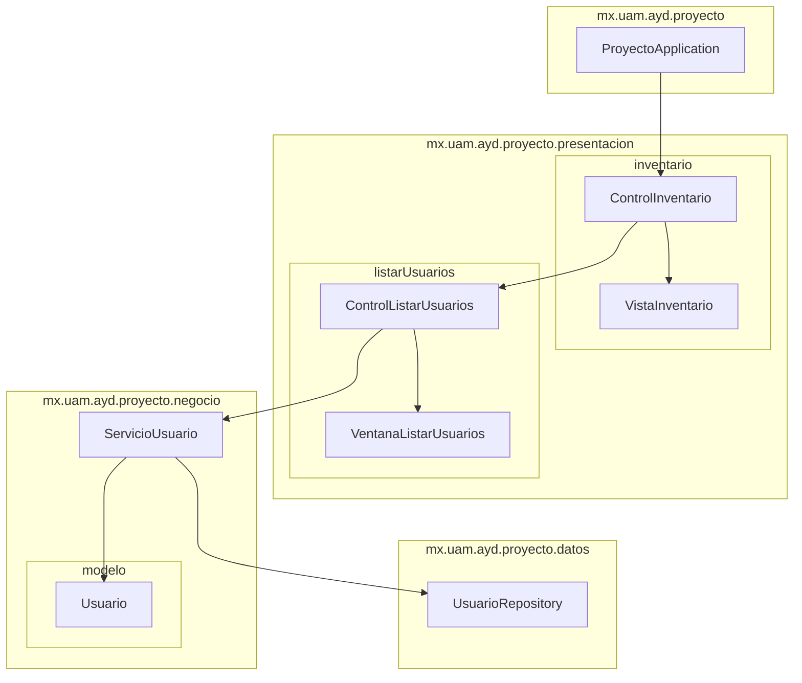

# Diagrama de paquetes: estructura del proyecto

Este diagrama resume las capas y dependencias de la consulta de usuarios.

## Responsabilidades principales

### Presentación

- `ControlInventario` coordina la vista inicial y el acceso a la consulta de usuarios.
- `ControlListarUsuarios` y `VentanaListarUsuarios` presentan el identificador, nombre y rol de cada usuario.

### Negocio

- `ServicioUsuario` recupera los usuarios registrados.
- `Usuario` conserva únicamente su identificador, nombre, rol y conciliaciones.

### Datos

- `UsuarioRepository` proporciona las operaciones CRUD de usuarios.

La aplicación mantiene la separación entre presentación, lógica de negocio, modelo y persistencia mediante inyección de dependencias de Spring.
